# Ticketing Web Application

I developed a ticketing application using Laravel and Bootstrap. Utilizing Laravel's built-in features and libraries, I implemented various functionalities, including user authentication, ticket submission, image upload, profile management, and admin feedback. Additionally, I added extra features such as chart generation and image search using the Unsplash API. Working independently, I designed and implemented the application from start to finish, ensuring a seamless and efficient ticketing system. By leveraging Laravel's capabilities and incorporating additional functionalities, I created a fully functional ticketing application that provided an enhanced user experience.

# Video Demo Ticketing Web Application :

 

| Name  | Description | Preview |
| ------------- | ------------- |------------- |
| Sign up | Users need to Sign up to create an account | 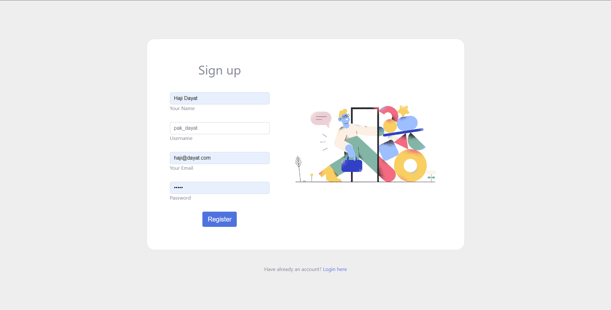 |
| Log in | After successfully to register, users need to log in before entering the dashboard | 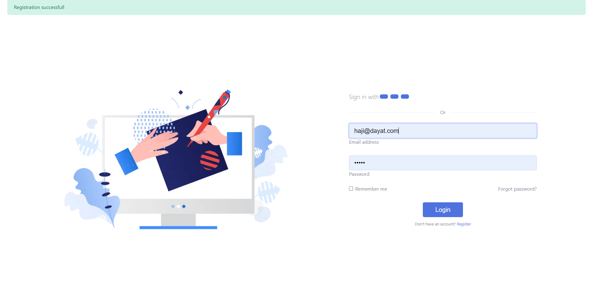 |
| Dashboard | After logging Users can see all the information about their ticket, because I'm a new user, i don't have any tickets | 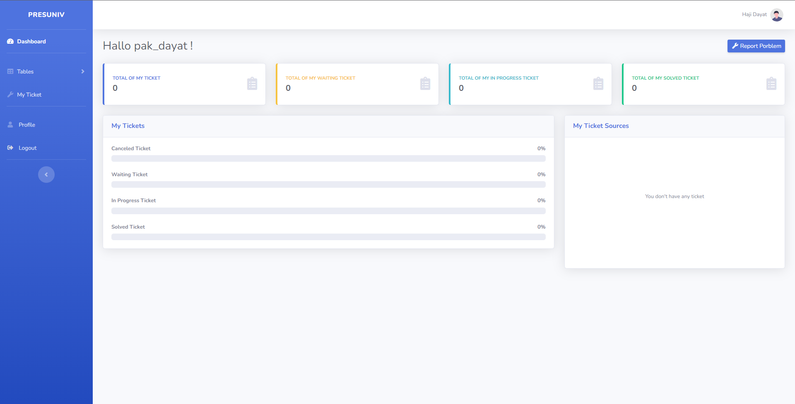 |
| Profile | Users can update their profile and upload their photo profile | 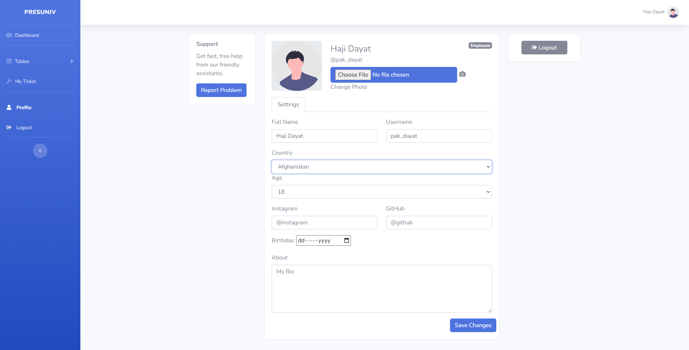 |
| Table Employee | Users can see all the employee in Table Employees | 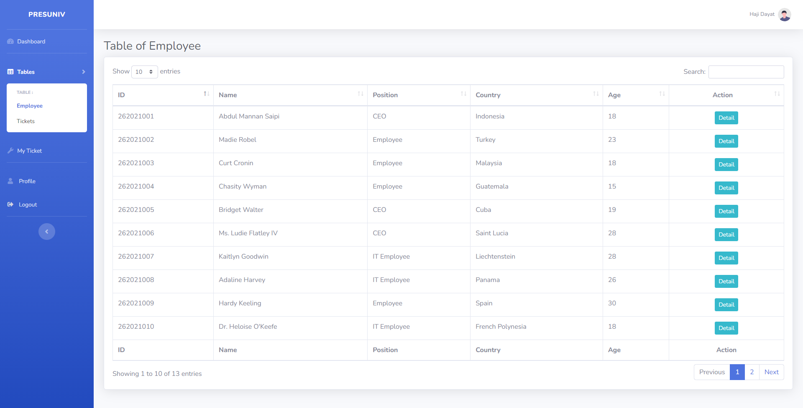 |
| Detail Employee | Users can view the detail of the Employee but only Super Admin/CEO can edit and delete the Employee | 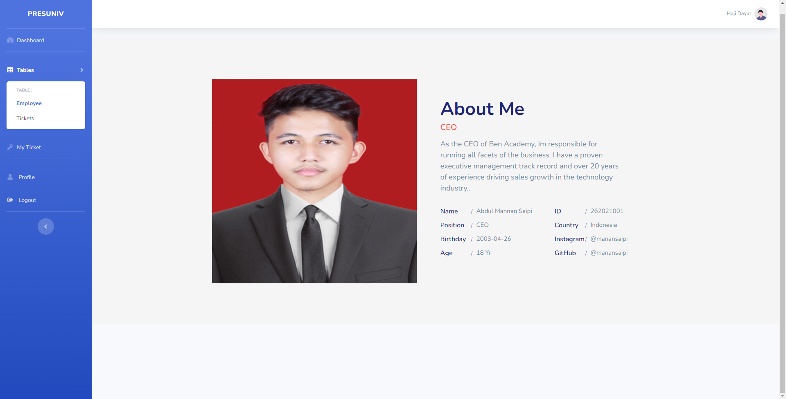 |
| Table Ticket | Users can see all the ticket in Table ticket | 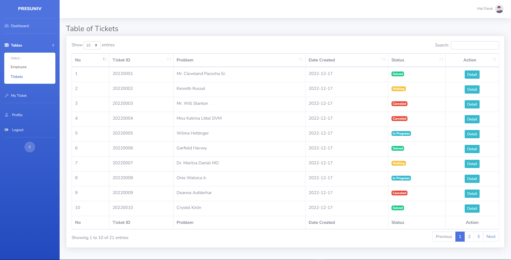 |
| My Ticket | Users can see all their ticket in my ticket. because i'm haven't create it yet so it show 'you don't have any ticket' | 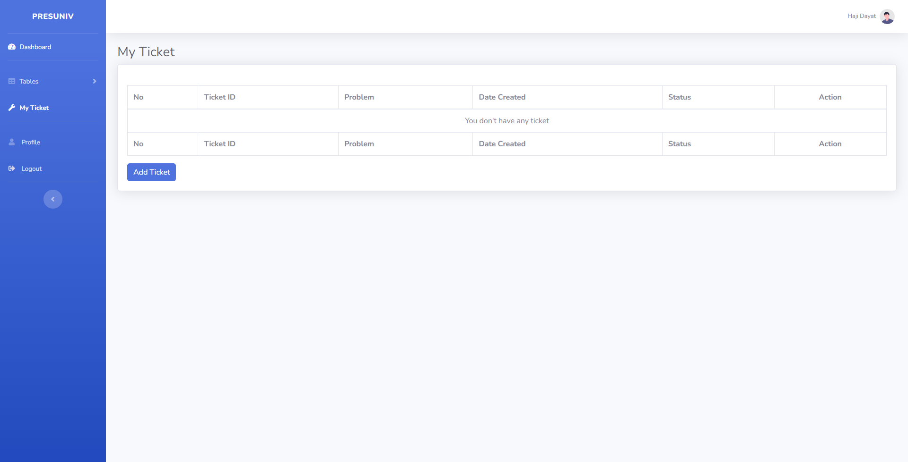 |
| Create Ticket | Users can create a ticket/report a problem and wait to be solved by CEO/IT Employee | 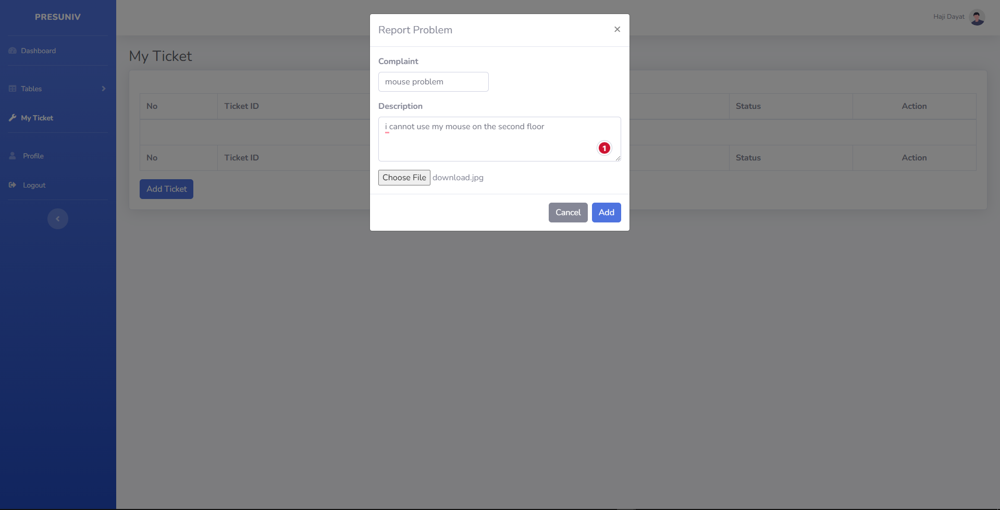 |
| My Ticket | After successfully creating ticket, users can see their ticket in my ticket |  |
| Edit or Cancel Ticket | Users can edit or update their ticket if the ticket status is waiting | 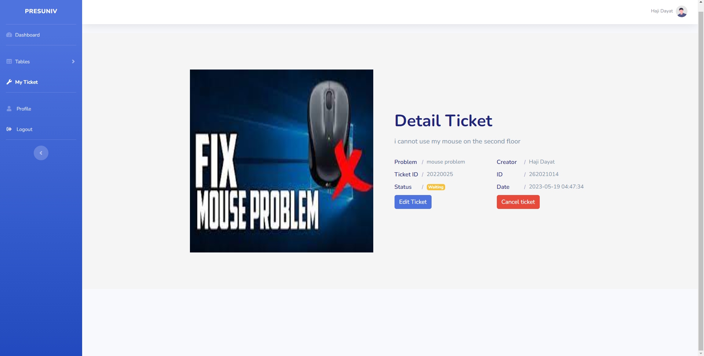 |
| Dashboard Information | Users can see their ticket status on the dashboard | 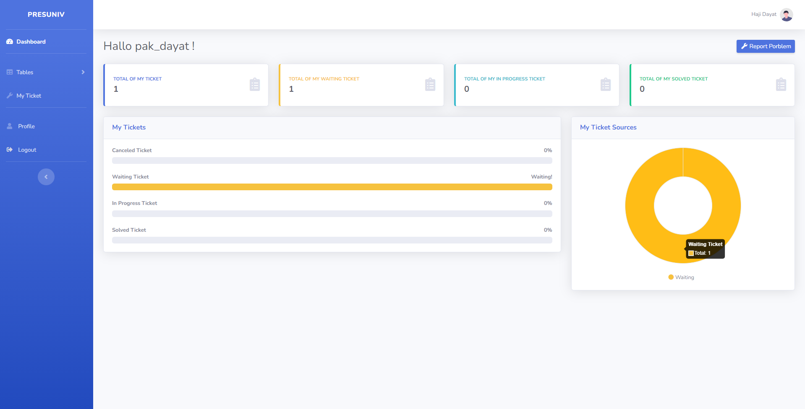 |
| Admin Dashboard | Admin can see all the tickets status in the dashboard | 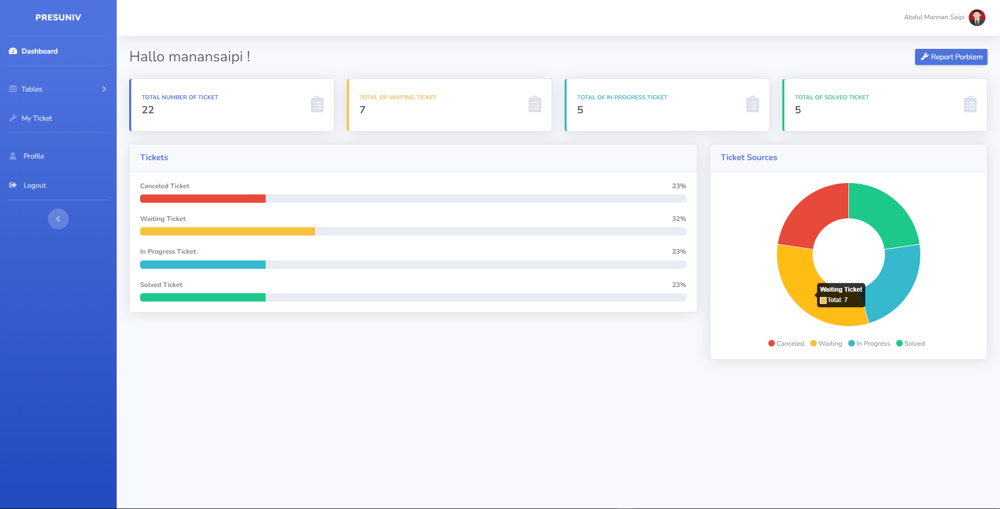 |
| Detail Employee | Admin can update user profile or delete users |  |
| Update Employee | Admin can update profile or promote users to become IT Employee or CEO | 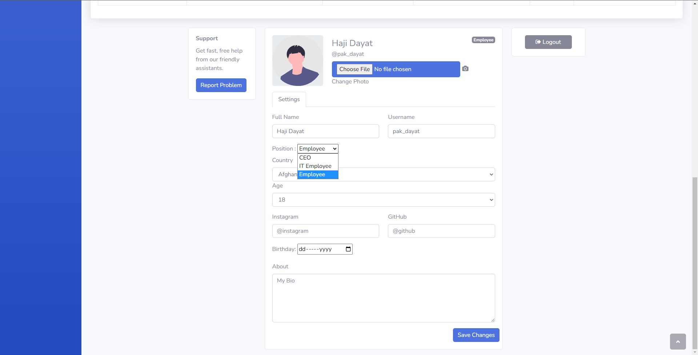 |
| All Ticket | Admin can see all ticket and solved the ticket | 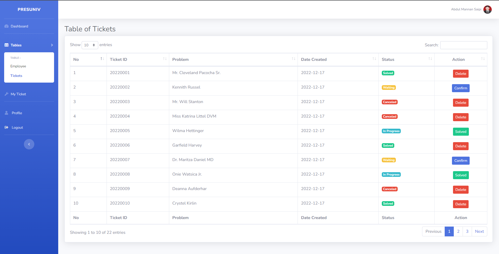 |
| Solved Ticket | Admin can solved users ticket and give a feedback to it | 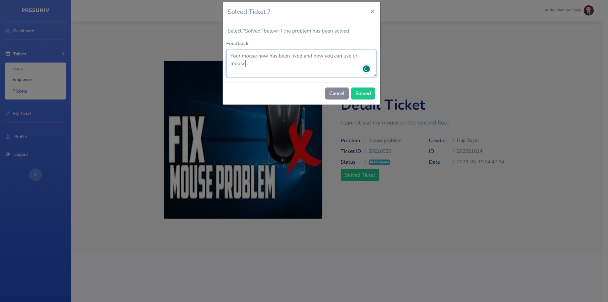 |
| Status Ticket | After admin solved and gived feedback to the ticket, users can see their ticket status on dashboard changed| 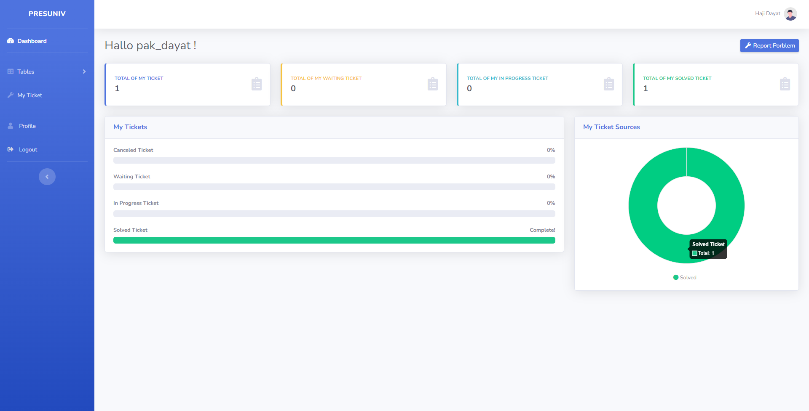 |
| See Feedback | Users can see the feedback given by admin in my ticket | 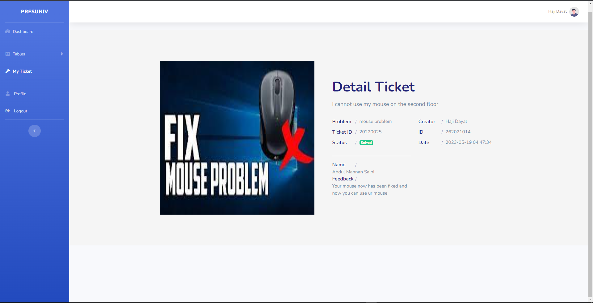 |
| Delete Ticket | Admin can delete ticket if the ticket was solved or cancaled by the users | 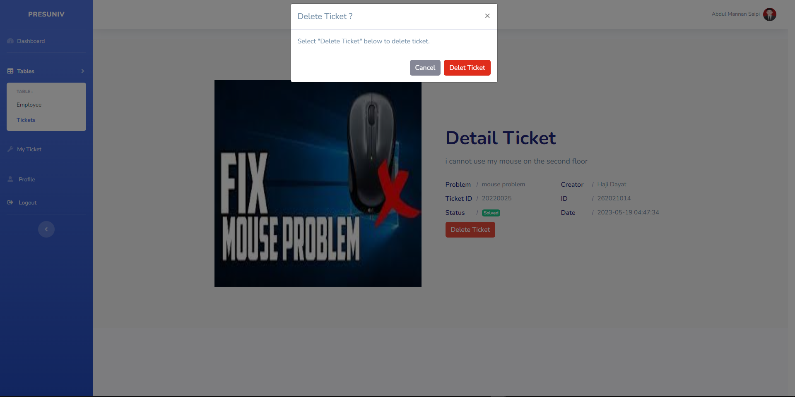 |

---

